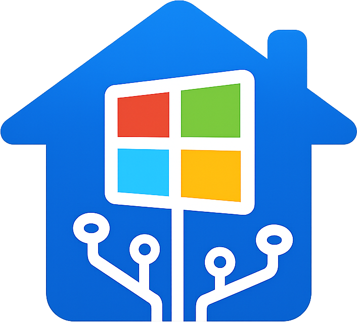

<p align="center">
  
</p>

<h1 align="center">HA Win</h1>

Windows 10/11 MQTT bridge for Home Assistant with built-in discovery.

## Highlights
- MQTT discovery for restart/shutdown/standby buttons
- Home Assistant MQTT notify integration to deliver PC notifications
- Tray icon and background operation
- Simple settings UI with auto-start toggle

## Requirements
- Home Assistant with the MQTT integration configured
- Windows 10/11
- .NET 10 runtime (SDK only required for building)

## Installation

### 1. Installer
- Donwload the latest Setup exe file and execute it.

### 2. Manual installation
- Download the zip and copy it to the programms directory and execute the `.exe`
- Download the latest zip and run the app from the extracted folder.

### 3. Compile yourself
- Donwload the source code
- run 
```powershell
dotnet build .\src\HaWin\HaWin.csproj
```

---

## Quick start
1. Run HA Win and open settings from the tray icon.
2. Configure your MQTT broker and save.
3. Home Assistant will discover a new device and entities automatically.

## MQTT topics
Device namespace uses a sanitized machine name: `ha-win/<device-id>`.

### Buttons (auto created via discovery)
- `ha-win/<device-id>/restart/set`
- `ha-win/<device-id>/shutdown/set`
- `ha-win/<device-id>/standby/set`

### Notifications
- Command topic: `ha-win/<device-id>/notify`

Payload options:
- Plain text: `Hello from Home Assistant`
- JSON: `{ "title": "Door", "message": "Front door opened" }`